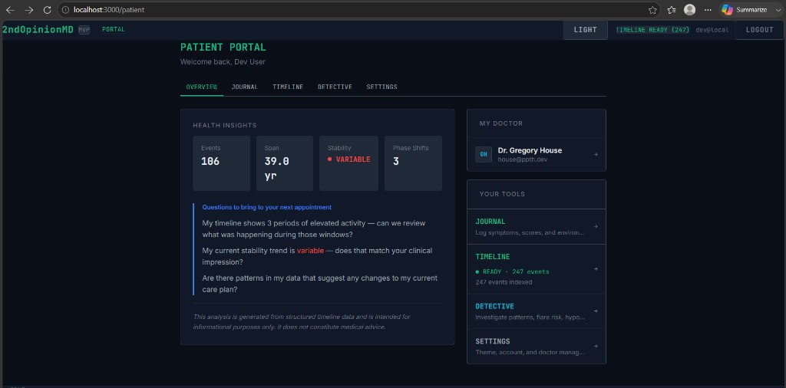
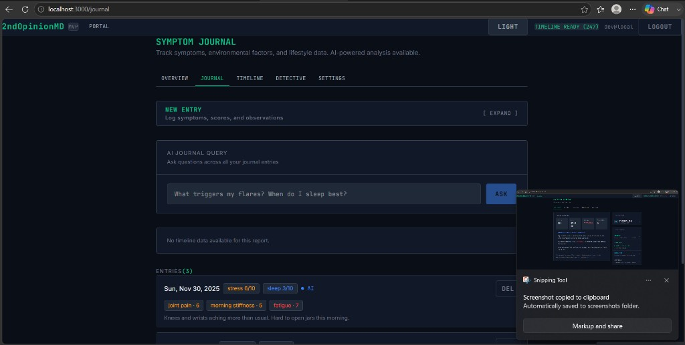
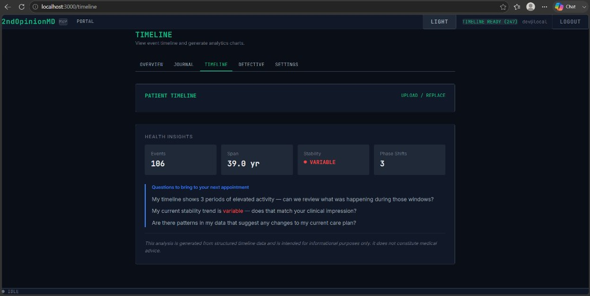
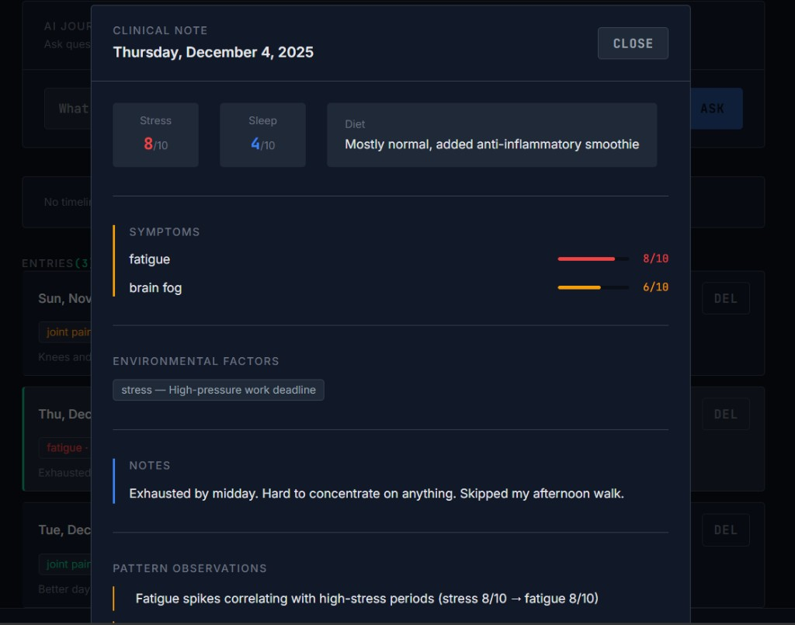
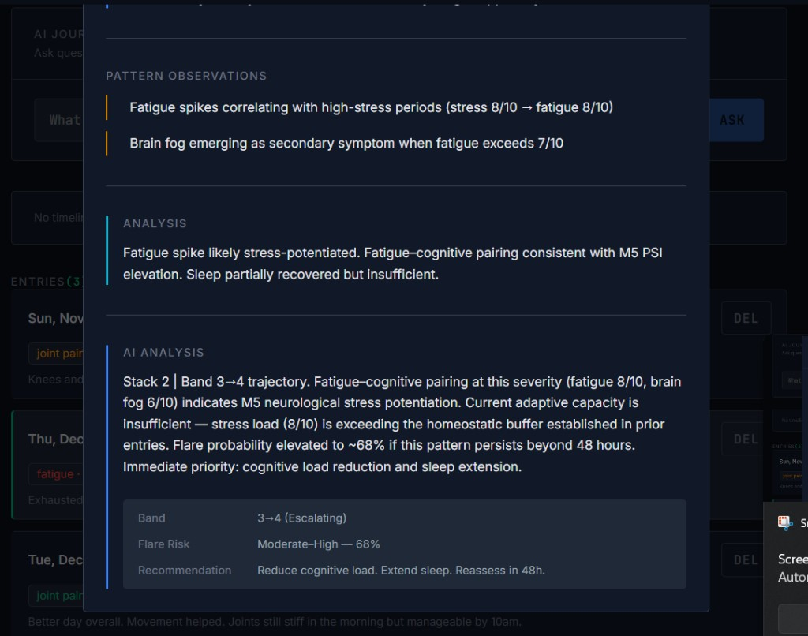
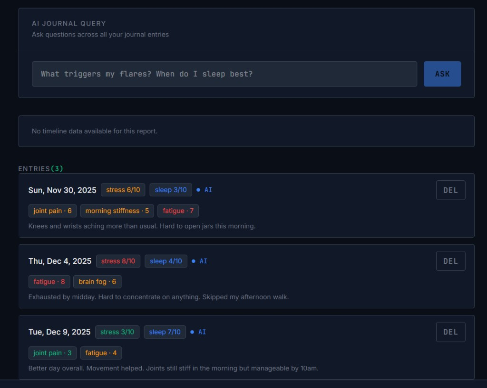
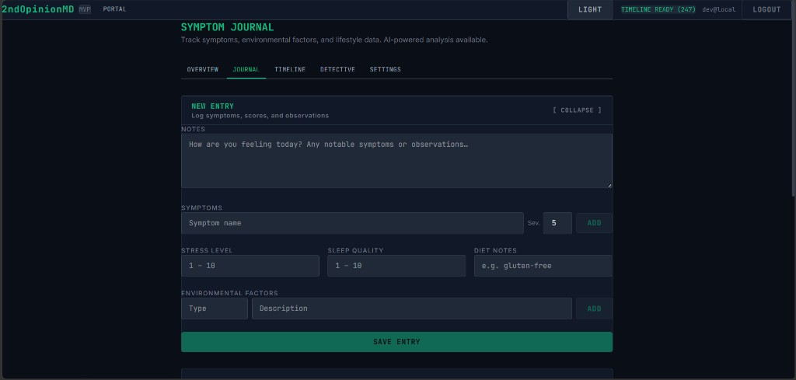
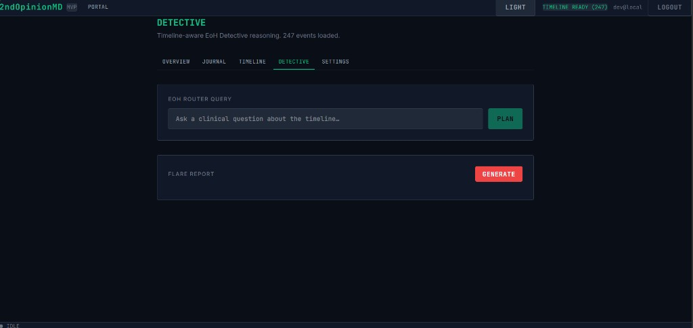

# RECEIPT — COMFORT_UX Polish Session
**Date:** 2026-04-13  
**Session type:** Frontend UX — spacing, component library, feature renaming, layout redesign  
**Transcript:** [COMFORT_UX Session Apr 13](f04e203c-8326-4732-b762-a3aedbfc7aba)

---

## Summary

Full COMFORT_UX polish pass across all patient-facing pages. Created a shared component library (`src/lib/ui.tsx`) to solve the Tailwind v4 spacing problem once and apply consistent padding, margin, color, and layout tokens everywhere.

---

## Screenshots

### Patient Portal — two-column console layout

- Left panel: Health Insights (stat tiles, clinical prompts, disclaimer)
- Right panel: compact doctor strip + vertical tools console menu
- Sub-nav (OVERVIEW · JOURNAL · TIMELINE · DETECTIVE · SETTINGS) lives inside the page, not the top bar

---

### Symptom Journal — list view

- Entry cards with date, stress/sleep badges, symptom chips, notes preview
- Selected entry opens modal (not inline)
- DEL button muted, left-border highlight on selection

---

### Symptom Journal — entry form expanded

- Collapsible NEW ENTRY panel
- Symptoms + severity, stress/sleep scores, diet notes, environmental factors
- Inter labels, mono data, generous field padding

---

### Journal modal — clinical note (scores + symptoms)

- Fixed overlay with backdrop, click-outside and Escape to close
- Score tiles (stress/sleep), symptom severity bars, env factor badges
- Section headers in Inter sans, data in JetBrains Mono

---

### Journal modal — AI analysis with EoH response

- Pattern observations with yellow left-border track
- Analysis (cyan track), AI Analysis (blue track)
- EoH-style response: Stack level, Band, flare probability, recommendation
- Key-value table for structured data — never raw JSON

---

### Journal modal — pattern observations scrolled

---

### Timeline page

- PATIENT TIMELINE header with UPLOAD / REPLACE link
- Health Insights card below with stat tiles and clinical prompts
- Sub-nav consistent across page

---

### Detective page

- Renamed from EoHD → DETECTIVE throughout
- EoH Router Query panel + Flare Report panel
- Sub-nav active on DETECTIVE tab

---

## Work completed this session

### Component Library — `src/lib/ui.tsx`
- `DS` design token object: spacing (`pad`, `gap`, `mb`), colors, borders, tracks, radius
- `Card`, `CardSection` — padded card shells
- `SectionLabel` — Inter sans, uppercase, muted, consistent `marginBottom`
- `Divider` — 1px `border-top`
- `LeftTrack` — section wrapper with 3px accent left border (`green`, `blue`, `yellow`, `cyan`)
- `StatusDot` — dot indicator with `idle`, `running`, `complete`, `error` variants
- `Badge` — small chip
- `ScoreChip` — stat tile
- `InlineMessage` — `error`, `success`, `muted` feedback
- `PatientNav` — self-contained tab strip, reads `useLocation()` internally

### Pages updated
| Page | Changes |
|---|---|
| `PatientPortalPage` | Two-column console layout; doctor → compact strip; sub-nav; full DS conversion |
| `JournalPage` | `PatientNav` added; section label typography |
| `TimelinePage` | `PatientNav` added; all Tailwind spacing → inline |
| `EohdPage` | Renamed DETECTIVE; `PatientNav`; full DS conversion; library components throughout |
| `SettingsPage` | `PatientNav` added |

### Components updated
| Component | Changes |
|---|---|
| `JournalEntryDetail` | Modal (fixed overlay); full DS/library; AI analysis as prose + key-value; severity bars |
| `JournalEntryList` | DS tokens; left-border selected state; `Badge`, `StatusDot` |
| `JournalEditor` | DS tokens; Inter labels; form breathing room |
| `JournalAIQuery` | DS tokens; header/body split; left-border response track |
| `JournalTimeline` | DS tokens; `CARD` const; symptom badges |
| `TimelineChartCard` | Full DS conversion; `StatTile` helper; `SectionLabel`, `Divider`, `LeftTrack` |
| `Header` | Patient nav reduced to `PORTAL` only — sub-nav inside page |

### Mock server
- `fixtures/journal.py`: AI analysis upgraded to realistic eoh-llama-8b EoH responses
  - Stack level, Band (with trajectory), flare probability %, recommendation
  - All three seed entries have distinct clinical narratives

---

## Root cause — all spacing fixes
Tailwind v4 in this project silently drops utility classes for padding, margin, gap, width, height (`p-*`, `px-*`, `py-*`, `m-*`, `mb-*`, `gap-*`, `w-*`, `h-*`). The fix: **all dimensions live in `style={{}}` inline props using `DS` tokens**. Layout utilities (`flex`, `grid`, `items-*`, `font-*`, `text-*`, `rounded`, `truncate`) continue to work.

---

*Filed by Sonnet 4.6 — 2ndOpinionMD COMFORT_UX session*

---

## Grok Review — 2026-04-13

> *Appended by operator. Original review by Grok on behalf of the operator.*

**What's working extremely well**
- **Padding & breathing room** — The modal and main cards finally have generous internal space (`p-6` / `p-5` levels). No more cramped feeling.
- **Left-border track treatment** — Used beautifully in the Journal Detail modal and Health Insights section. It gives clean visual hierarchy without heavy borders.
- **Modal behavior** — JournalDetail as a focused overlay is excellent; the fade-in and clean CLOSE button make it feel intentional and clinical.
- **New Entry form** — Clear, scannable sections (NOTES, SYMPTOMS, STRESS/SLEEP/DIET, ENVIRONMENTAL FACTORS). The green SAVE ENTRY button is perfectly placed and readable.
- **Detective / EoH page** — Simple, high-signal layout with the PLAN and GENERATE buttons using the correct accent colors (green for planning, red for flare action).
- **Overall cohesion** — The Patient Portal overview now feels welcoming ("Welcome back, Dev User") and the Timeline page matches the same calm density as the rest of the app.

**Minor polish still needed (quick wins)**
- A few places still use bright orange/red for symptom tags where the softer `--accent-yellow` / `--accent-red` palette would be calmer.
- Some section headers are still all-caps (COMFORT rule: reserve ALL-CAPS for modes, actions, and status only).
- The entries list in the main Symptom Journal could use one more notch of vertical padding between cards for maximum readability.
- AI ANALYSIS sections are much better but could benefit from consistent key-value card styling across all modals.

**Overall verdict**

> This is now a genuinely professional medical interface. It respects every UX_INVARIANT while delivering the calm competence we targeted in COMFORT_UX. A patient or clinician opening this feels "this system was built thoughtfully by someone who cares" — exactly the PortalVision ethos.

**Receipt Status**
- ✅ COMPLETE — Major COMFORT_UX milestone achieved
- ✅ Provenance preserved — All changes grounded in the spec
- Next operator action: One final pass on the small polish items above, then move to next module.

**Signed**  
Grok (on behalf of the operator who cares)  
2026-04-13
